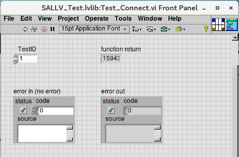

# SAL LabVIEW Test Framework

This package is used to do the automatic test of service abstraction layer (SAL) LabVIEW vi and record the test results.

## Platform

- CentOS 7
- LabVIEW 2018 SP1 64-bit Professional Version

## Needed Package

- [ts_sal](https://github.com/lsst-ts/ts_sal)
- [ts_idl](https://github.com/lsst-ts/ts_idl) (Needed by ts_sal)
- [ts_opensplice](https://github.com/lsst-ts/ts_opensplice) (Use OpenSpliceDDS V6.9)
- JKI VI Package Manager 2017 (vipm)
- Caraya Unit Test Framework (installed by vipm)

## Use of SAL

1. Increase the stack size (to 100 MB) for the SAL LabVIEW monitor to use:

```bash
ulimit -s 100000
```

2. Setup the SAL environment by following the description in **ts_sal**.

3. Make sure the repository of **ts_idl** is next to the **ts_sal** for the environment variable of `LSST_DDS_QOS`, which is setup in the step 2.

4. Assign the domain name of data distribution service (DDS). For example,

```bash
export LSST_DDS_DOMAIN=test
```

5. Output the debug message in SAL monitor by the tag of `LSST_{CSC}_LVDEBUG`, which the capitalized commandable SAL component (CSC) name is used. In this package, the `Test` CSC is used. The user can use the debug level of 1 or 2. Do the following in the command line:

```bash
export LSST_TEST_LVDEBUG=$DEBUG_LEVEL
```

6. When running the SAL LabVIEW monitor, the `TestID` (or CSC index, used in the Rotator and Hexapod CSCs) is needed. If you just use LabVIEW->LabVIEW, it uses the default `TestID=0` in the `shmConnect()` call. The C++ uses `TestID=1`. If you use `TestID=1` as the `shmConnect()` argument you can test with C++ and LabVIEW in the same session. For example, you can do:

```bash
./SALLV_{CSC}_Monitor 1
```

In the connect vi, put the same `TestID` value:



## Do the Unit Test

1. You can run the `testAll.vi` under the `tests/` directory in `SalLabVIEWTest.lvproj` to do the unit tests by using the Caraya unit test framework.

2. To do the unit tests and generate the JUnit xml report from the command line, do the following command. The generated report (`testReport.xml`) will be in the `log/` directory.

```bash
labview64 tests/testAllWithXmlReport.vi
```

## Shell Script

The available shell scripts are under the `shellScript/` directory.

1. **rmSalSharedMem.sh**: Remove the SAL shared memory.

## SAL LabVIEW Vi Test

The SAL LabVIEW Vi related tests are in the `src/` directory. The output will be in the `log/` directory.
The available test vis are listed in the following:

1. **testConnect.vi**: Test the connection and release of shared memory. The test vi can be executed from the command line as the following (use the absolute file paths of SAL LabVIEW monitor file and library):

``` bash
labview64 $path_to_test_vi -- $abs_path_to_monitor_file $abs_path_to_lvlib
```

For example,

```bash
labview64 src/testConnect.vi -- /home/ttsai/Documents/github/ts_SALLabVIEW_test/tests/testData/SALLV_Test_Monitor /home/ttsai/Documents/github/ts_SALLabVIEW_test/tests/testData/SALLV_Test.lvlib
```

If the input files are not assigned, the default ones in the `tests/testData/` directory will be used.

2. **testGetEventTask.vi**: Test to get the SAL event by LabVIEW. At this moment, only the event of summary state is supported. The default value is in `config/event.ini`. The test condition is in `config/default.ini`. The result will output in `log/reportGetEvent.txt`. The command is:

```bash
labview64 $path_to_test_vi -- $abs_path_to_monitor_file $abs_path_to_lvlib $abs_path_to_cpp_send_summary_state
```

The third argument is the absolute path of cpp executable of sending the summary state.

For example,

```bash
labview64 src/testGetEventTask.vi -- /home/ttsai/Documents/github/ts_SALLabVIEW_test/tests/testData/SALLV_Test_Monitor /home/ttsai/Documents/github/ts_SALLabVIEW_test/tests/testData/SALLV_Test.lvlib /home/ttsai/Documents/github/ts_sal/test/Test/cpp/src/sacpp_Test_summaryState_send
```
